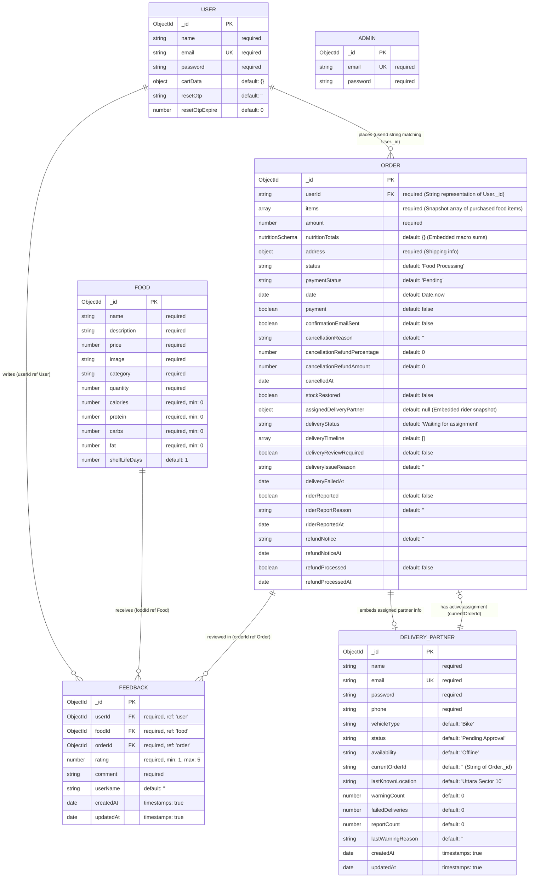

# 🥗 FitFuel — Complete Database Architecture & ERD

This is the exact database schema specification for the **FitFuel** project, detailing every model, field, and database relation found in the codebase.

---

## 📊 Entity Relationship Diagram (ERD)

Here is the exact schema relations of the project represented using Mermaid notation:

---

## 📂 Detailed Collection Specifications

### 1. `USER` Collection
* **Source**: [userModel.js](file:///c:/Users/User/OneDrive/Documents/MREN/FoodOrderingSystem/backend/models/userModel.js)
* **Configuration**: `{ minimize: false }` (Preserves empty objects like empty `cartData` in MongoDB).

### 2. `FOOD` Collection
* **Source**: [foodModel.js](file:///c:/Users/User/OneDrive/Documents/MREN/FoodOrderingSystem/backend/models/foodModel.js)
* **Nutritional Macros**: Stored alongside menu details to power user calorie/macro logging metrics.

### 3. `ORDER` Collection
* **Source**: [orderModel.js](file:///c:/Users/User/OneDrive/Documents/MREN/FoodOrderingSystem/backend/models/orderModel.js)
* **Embedded Sub-schemas**:
  * **`nutritionTotals`**: Embeds a `nutritionSchema` containing totals for `calories`, `protein`, `carbs`, and `fat`.
  * **`items`**: Snapshots ordered items from the `FOOD` collection (stores `_id`, `name`, `price`, `quantity`, and macros at order time).
  * **`assignedDeliveryPartner`**: Snapshot of the assigned rider's details.

### 4. `FEEDBACK` Collection
* **Source**: [feedbackModel.js](file:///c:/Users/User/OneDrive/Documents/MREN/FoodOrderingSystem/backend/models/feedbackModel.js)
* **Indices**:
  * Compound index `{ userId: 1, foodId: 1, orderId: 1 }` configured as `{ unique: true }`. This strictly enforces that a customer can only submit one feedback per food item per order context.

### 5. `DELIVERY_PARTNER` Collection
* **Source**: [deliveryPartnerModel.js](file:///c:/Users/User/OneDrive/Documents/MREN/FoodOrderingSystem/backend/models/deliveryPartnerModel.js)
* **Configuration**: `{ timestamps: true }` (adds `createdAt` and `updatedAt`).

### 6. `ADMIN` Collection
* **Source**: [adminModel.js](file:///c:/Users/User/OneDrive/Documents/MREN/FoodOrderingSystem/backend/models/adminModel.js)
